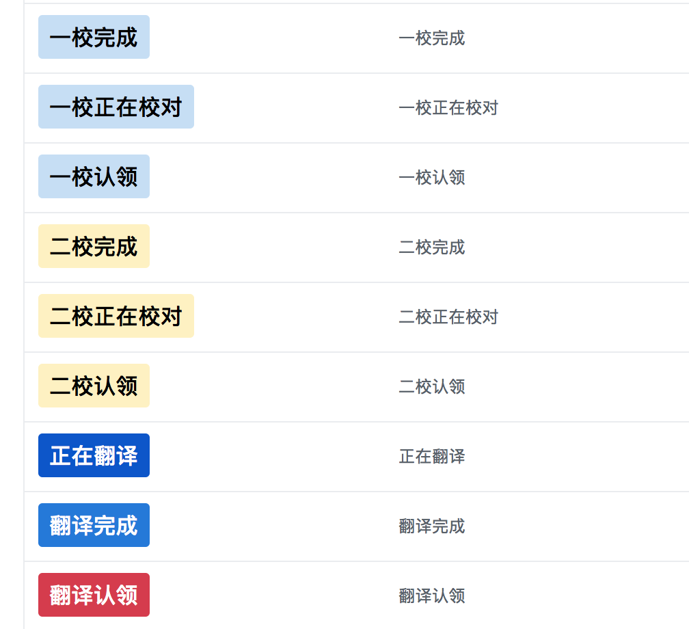
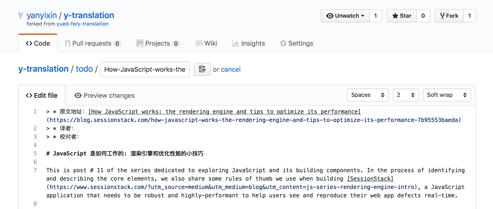
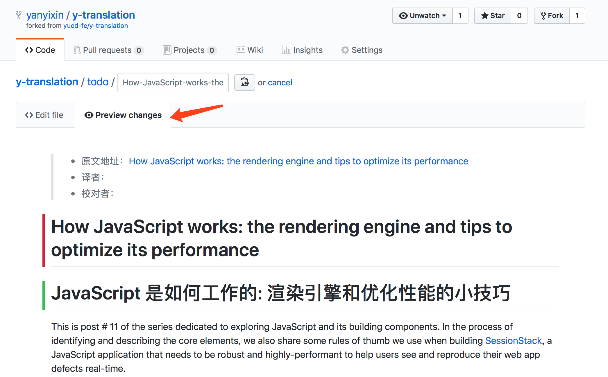
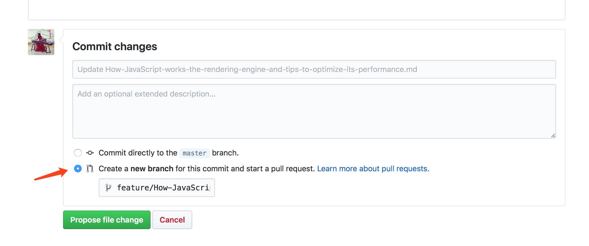
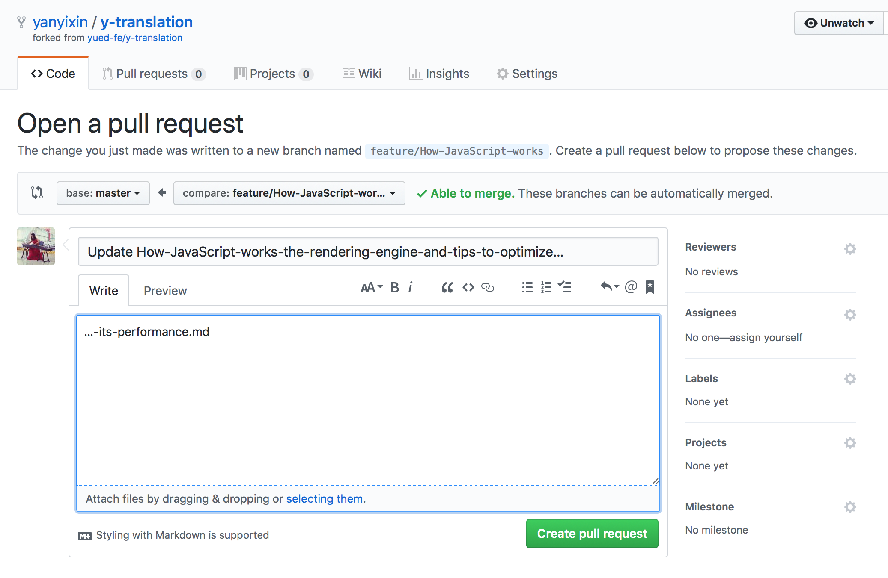
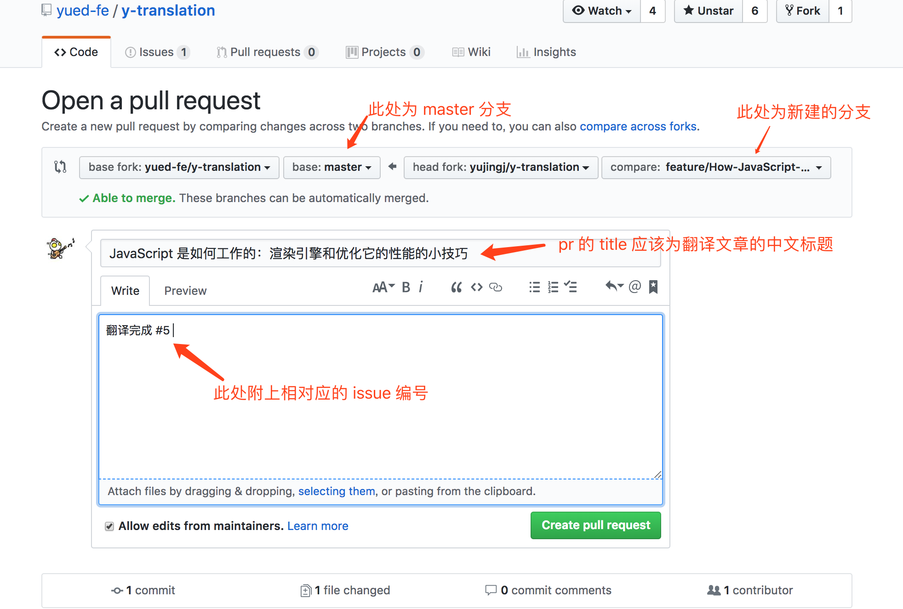
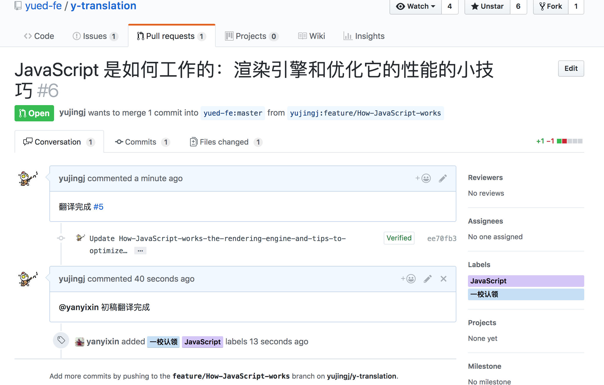
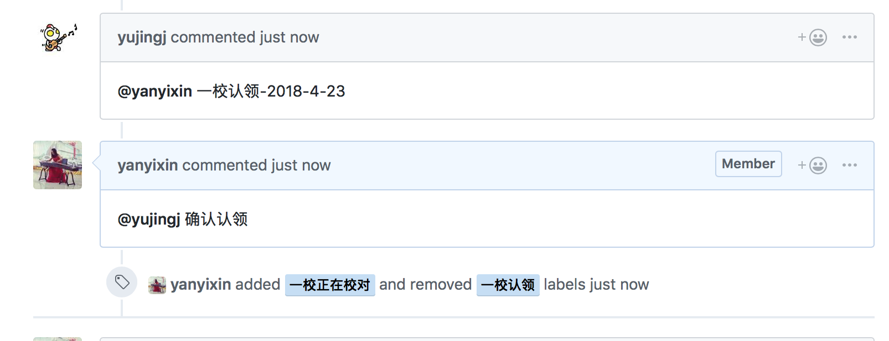
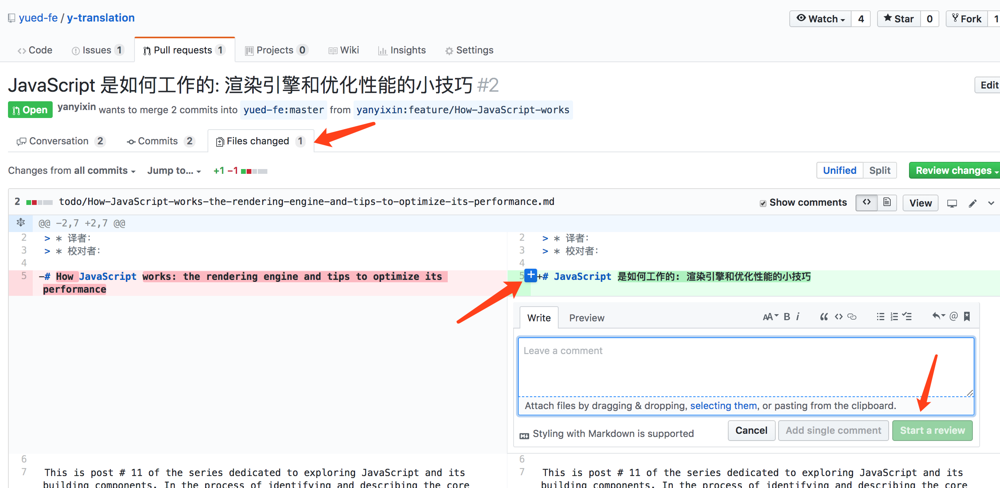

## 翻译流程

下面展示一次完整的翻译流程。 

### 一、把项目 Fork 到自己的仓库
### 二、认识 Issue 的各种状态
 在[目标翻译项目的 Issues 中](https://github.com/yued-fe/y-translation/issues)提供了目前可认领分配的任务，任务采用文章的标题命名，同时可在列表中查看任务状态，如图所示。

 文章名称后面跟随着此文章所涉及的语言以及当前任务的状态，任务在进行到不同的阶段，Master 会根据进展情况进行手动状态同步，可变更的任务状态分为 5 种，如图所示。

### 三、翻译认领
译者可以在 Issues 中选择准备认领的翻译任务，并在 Issue 下留言并附上翻译完成时间（格式：`翻译认领-2018-04-15`），Master 会确认认领并修改 Issue 状态为`正在翻译`。

 

### 四、开始翻译

译者认领结束之后准备开始翻译，以 `How-JavaScript-works-the-rendering-engine-and-tips-to-optimize-its-performance.md` 为例，Github 进入自己刚刚 fork 的仓库，找到：`todo/How-JavaScript-works-the-rendering-engine-and-tips-to-optimize-its-performance.md`，选择 `Edit this file` ，如图所示。

Github 提供了在线编辑的功能，以在线功能为例，译者进入 `How-JavaScript-works-the-rendering-engine-and-tips-to-optimize-its-performance.md` 的修改页面，开始翻译并产生修改信息（这里可能在 Commit 时并没有翻译完成，没关系，流程一致），如下图所示，我翻译了标题：

而且通过点击 `Preview changes` 可以看到因为修改所产生的修改信息：

当你修改好之后，可以选择 `Create a new branch for this commit and start a pull request`，并在分支名称栏填写对应的 Issue 名产生分支，如图所示。

单击上图中 `Propose file change` 绿色按钮，创建分支，译者需要确认是否发起 `Pull request`。如果译者在本次创建分支的同时完成了翻译，可以直接跳到 `Pull request` 流程，否则译者需要自行回到创建的分支翻译文章，**直到翻译结束后**发起 `Pull request`，如下图所示。

### 五、完成翻译，发起 Pull request

译者在自建的分支翻译结束后，发起 `Pull request`，如下图所示。

创建一个新的 `Pull Request` 页面，选择 base 为 原项目的 `master` 分支主干，选择 `compare` 为创建的翻译文章分支（此处为`feature/How-JavaScript-works`）。如下图：

如上图，单击底部的`Create pull request`绿色按钮，创建 PR。在 PR 上留言 `初稿翻译完成`，**并附上对应的 Issue 链接**， Master 收到留言会修改 `Issue` 的属性。

**注意：** 提交的 pr 标题应该为翻译的文章的中文标题。

### 六、认领校对

认领校对的成员可以是对这篇文章感兴趣的成员，也可以是同一个项目组的成员。

如需认领，在 PR 留言，并附上校对完成时间即可（格式： `认领校对-2017-07-01`）。Master 收到留言会确认校对的授权工作。此时，校对者就可以开始校对工作了。

### 七、开始校对
前往 `Pull request` 页面列表内选择认领的 PR，进入页面，点选`Files changed` 查看变更内容，校对在问题行上填写批注建议。如下图所示。

填写好建议之后，译者就能看到对应的批注了。

### 八、校对完成
校对者完成校对后，在该 PR 下留言`校对完成`。

### 九、译者再次修改
校对完成之后，Master 会通知译者前往 PR 查看校对者留言信息。译者根据留言修改译文。译者自身确认修改完毕后，进入该 PR，留言`修改完毕`。

### 十、翻译完成
项目 Master 看到 PR 内的`修改完毕`留言，执行对应 PR 的合并，整块流程结束。