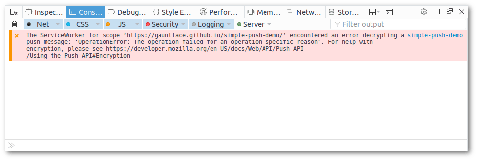
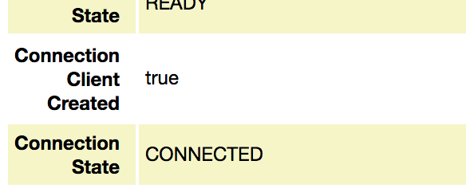

>原文地址：https://developers.google.com/web/fundamentals/push-notifications/common-issues-and-reporting-bugs

>译文地址：

>译者：刘文涛

>校对者：

# Web 推送：常见问题以及错误反馈

当你使用网络推送遇到问题时，可能很难去调试这个问题或寻求帮助。 本文将概述一些常见问题以及如果你在Chrome或Firefox中发现错误，应该怎么去做。

在我们深入调试推送之前，你可能遇到 service workers 本身的问题，文件未更新，未注册或一般的异常行为。 关于[调试 service workers](https://developers.google.com/web/fundamentals/web/fundamentals/getting-started/codelabs/debugging-service-workers/) 的文档非常完善，如果你是初次使用 service worker 开发的话 ，我强烈建议你去阅读一下。

在开发和测试Web推送两个阶段中，每个阶段都遇到独有的常见问题。     
       
- **发送消息：**首先确保发送消息成功。正确返回的 HTTP 状态码应该是201。 如果不是：
	- **检查授权错误：**如果收到授权错误消息，请参阅下面 “授权相关问题部分"。
	- **其他API错误：**如果收到非201状态代码，请参阅下面的 “HTTP状态代码部分“ 以获取有关问题原因的指导。
- **接收消息：**如果你能够成功发送消息，但在浏览器上未收到消息：
	- **检查加密问题：**请参下面的 “有效负载加密问题部分“。
	- **检查连接问题：**如果是在 Chrome 上出的问题，可能与连接有关。 可参阅下面的“连接问题”部分。

如果无法发送和接收推送消息，并且本文档中的相关部分不能帮助你调试问题，那么你可能发现了推送机制本身的一个 bug。在这种情况下，请参阅 “如何提交错误报告”部分，提交一份包含所有重要信息的错误报告，以加快错误修复过程。

在提交错误报告之前我想说的一件事是：**Firefox 和 Mozilla 自动推送服务给了很多有用的错误信息**。 如果你遇到问题并且不确定是什么问题的时候，那么请在Firefox中进行测试，看看是否可以收到了更有用的错误消息。

## 授权问题

授权问题是开发人员在开始使用Web推送时遇到的最常见问题之一。 这通常是配置站点[应用服务器密钥（又名VAPID密钥）](https://tools.ietf.org/html/draft-ietf-webpush-vapid-02)的问题。

在Firefox和Chrome中，支持推送的最简单方法是在 `subscribe()` 调用中提供 `applicationServerKey`。这样做不好的是，前端和服务器密钥之间的任何差异都会导致授权错误。

### 在chrome + 云消息传递FCM

对于使用FCM作为推送服务的Chrome，你将收到来自FCM：关于`UnauthorizedRegistration` response【未经授权注册】 的一系列不同的错误，所有错误都涉及应用程序服务器密钥。

在以下任何一种情况下，你都会收到一个 `UnauthorizedRegistration` 错误：

* 没有在 FCM 的请求中定义 `Authorization` header。
* 用于订阅用户的应用程序密钥与用于签署 Authorization header 的密钥不匹配。
* 你的 JWT【Json web token】到期无效，即超过24小时或JWT已过期。
* JWT 异常或值无效。

完整的错误响应如下所示：

```
<HTML>\n<HEAD>\n<TITLE>UnauthorizedRegistration</TITLE>\n</HEAD>\n<BODY BGCOLOR="#FFFFFF" TEXT="#000000">\n<H1>UnauthorizedRegistration</H1>\n<H2>Error 400</H2>\n</BODY>\n</HTML>\n
```

如果你在Chrome中收到此错误消息，可以考虑在Firefox中进行测试，可能能够获得有关此问题的更多信息的话。

### Firefox and Mozilla 自动推送

Firefox和Mozilla 自动推送 为 `Authorization` 授权问题提供了一组非常友好的错误提示。

如果你的推送请求中未包含 `Authorization` header，你将会收到来自 Mozilla 自动推送的 `Unauthorized` 未授权的错误信息。

```
{  
	"errno": 109,  
	"message": "Request did not validate missing authorization header",  
	"code": 401,  
	"more_info": "http://autopush.readthedocs.io/en/latest/http.html\#error-codes",  
	"error": "Unauthorized"  
}
```

如果JWT的已过期，你将会收到一条 `Unauthorized` 未授权的错误信息，该信息说明该令牌已过期。

```
{  
	"code": 401,  
	"errno": 109,  
	"error": "Unauthorized",  
	"more_info": "http://autopush.readthedocs.io/en/latest/http.html\#error-codes",  
	"message": "Request did not validate Invalid bearer token: Auth expired"  
}
```

如果应用程序服务器密钥与订阅用户的授权标头签署时不同，则会返回未找到错误：

```
{  
	"errno": 102,  
	"message": "Request did not validate invalid token",  
	"code": 404,  
	"more_info": "http://autopush.readthedocs.io/en/latest/http.html\#error-codes",  
	"error": "Not Found"  
}
```

最后，如果你的的JWT中有无效值（例如，“alg”值是一个异常的值），你将会从Mozilla 自动推送中收到以下错误信息：

```
{  
	"code": 401,  
	"errno": 109,  
	"error": "Unauthorized",  
	"more_info": "http://autopush.readthedocs.io/en/latest/http.html\#error-codes",  
	"message": "Request did not validate Invalid Authorization Header"  
}
```

## HTTP 状态码

有一系列的问题可能导致推送服务返回非201响应代码。 下面是相关HTTP状态码列表及其与Web推送相关的问题描述。

<table>
<tr>
<th>Status Code</th>
<th>Description</th>
</tr>
<tr>
<td>429</td>
<td>请求太多。 应用程序服务器推送服务达到了速率限制。 推送服务应该包括 “Retry-After” 标头，来指示在下一个请求发出之前需要等多长时间。</td>
</tr>
<tr>
<td>400</td>
<td>无效的请求。 你的某一个header无效或格式不正确。</td>
</tr>
<tr>
<td>404</td>
<td>没有找到。订阅已过期。在这种情况下,你应该从你的后台删除 PushSubscription，并且等待一个时机再次给用户订阅。/td>
</tr>
<tr>
<td>410</td>
<td>失效. 订阅不再有效,应该从你的后台移除。这可以在 `PushSubscription` 上 通过调用 `unsubscribe()` 方法来移除。</td>
</tr>
<tr>
<td>413</td>
<td>有效载荷大小太大。 推送服务必须支持的最小大小有效负载是4096字节（或4kb）。 任何更大的大小都可能导致此错误。</td>
</tr>
</table>

如果http状态码不在此列表中且错误信息没有给到帮助，并且状态码当前状态可以被使用的情况下，可以查看下 [Web Push Protocol
spec (Web推送协议)](https://tools.ietf.org/html/draft-ietf-webpush-protocol)规范。

## 有效负载加密问题

如果可以成功触发推送消息（即向Web推送服务发送消息并接收到201响应码），但推送事件不会在 service worker 中触发，这通常表示浏览器无法解密其接收到的消息。

如果是这种情况，可以在 Firefox 的 DevTools 控制台中看到一条错误消息，如下所示：



要检查Chrome中是否存在此问题，请执行以下操作：

1. 地址栏输入 chrome://gcm-internals ，进入并点击“Start Recording【开始录制】”按钮。


2. 触发一个推送消息,看下“消息解密失败日志”。


如果有效负载的解密存在问题，将看到类似于上面显示的错误。 （请注意详细信息列中的`AES-GCM decryption failed`消息。）

如果是这个问题，有一些工具可以帮助你调试加密：

* [推送加密验证工具Peter Beverloo](https://tests.peter.sh/push-encryption-verifier/)
* [网络推送：Mozilla的数据加密测试页面](https://mozilla-services.github.io/WebPushDataTestPage/)

## 连接问题

如果你没有在 service worker 中收到推送事件，并且没有看到任何解密错误，可能是浏览器无法连接到推送服务。

在Chrome中，可以通过页面：`chrome://gcm-internals` 中的“接收消息日志”模块来检查浏览器是否正在接收消息。


如果没有及时看到消息，请确保你的浏览器的连接状态为 `CONNECTED`，如下图所示：



如果链接状态**不是** “CONNECTED”，可能需要删除当前的配置文件并创建一个新。 如果仍然无法解决问题，请按照下面章节的建议提出错误报告。

## 错误反馈

如果上面的方式都不能解决你的问题，并且没有迹象表明问题可能是什么，请根据你遇到问题的浏览器提出问题：

对于Chrome，你可以在此处反馈问题：[https://bugs.chromium.org/p/chromium/issues/list](https://bugs.chromium.org/p/chromium/issues/list)  

对于 Firefox，你可以在此处反馈问题: [https://bugzilla.mozilla.org/](https://bugzilla.mozilla.org/)

如何提供一个好的的错误报告，你应该做到以下几点：

* 你测试的浏览器版本（例如Chrome版本50，Chrome版本51，Firefox版本50，Firefox版本51）。
* 给出一个例子，可以重现这个问题；
* 报告中应该包括请求的所有信息（即对推送服务的网络请求的内容[包含header]）。
* 报告中应该包括网络请求的返回的响应数据。

如果你能提供一个可重现的例子,或者源代码或托管网站,它经常可以帮助我们快速解决问题。

