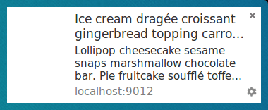
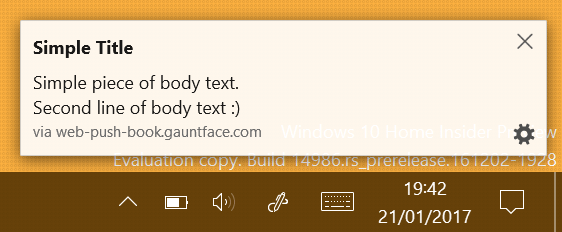
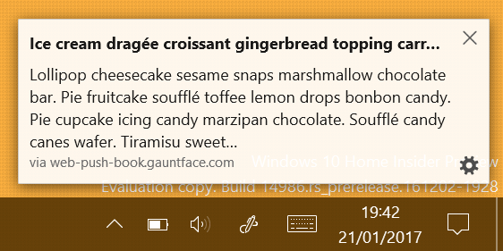
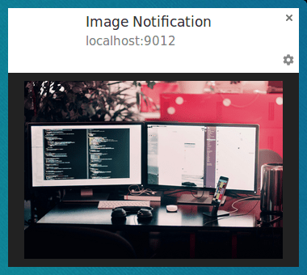
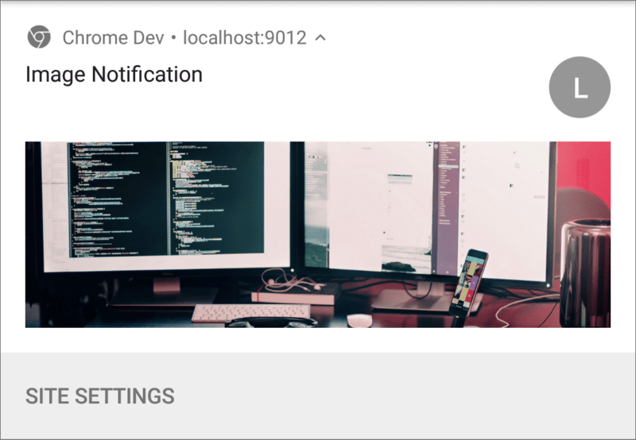
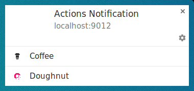
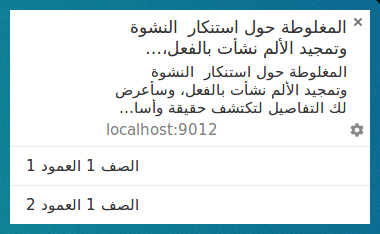

>原文地址：https://developers.google.com/web/fundamentals/push-notifications/display-a-notification

>译文地址：

>译者：刘文涛

>校对者：

# Displaying a Notification 
# 显示一个通知

I've split up notification options into two sections, one that deals with the visual aspects
(this section) and one section that explains the behavioural aspects of notifications.

我将通知参数分为两部分，一部分处理视觉（本节），另一部分解释通知的行为。

The reason for this is that every developer will need to be worried about
the visual aspects but the behavioural aspects you'll use will depend how
you use push notifications.

这么做的原因是每个开发人员都需要担心视觉方面，而行为方面则取决于你使用推送的方式。

All of the source code for these demo's is taken from a demo page I put together. If you want
to test them out for yourself then click the button below.

下面所有的例子的源代码，都来自我的一个demo页面。 如果你想自己测试它们，请点击下面的按钮。

[Notification Demos](https://web-push-book.gauntface.com/demos/notification-examples/)

## Visual Options

## 视觉显示相关参数

The API for showing a notification is simply:

显示一个通知的API很简单，如下：

    <ServiceWorkerRegistration>.showNotification(<title>, <options>);

Where the title is a string and options can be any of the following:

title是一个字符串，options 的参数如下：

    {
      "//": "Visual Options",
      "body": "<String>",
      "icon": "<URL String>",
      "image": "<URL String>",
      "badge": "<URL String>",
      "vibrate": "<Array of Integers>",
      "sound": "<URL String>",
      "dir": "<String of 'auto' | 'ltr' | 'rtl'>",

      "//": "Behavioural Options",
      "tag": "<String>",
      "data": "<Anything>",
      "requireInteraction": "<boolean>",
      "renotify": "<Boolean>",
      "silent": "<Boolean>",

      "//": "Both Visual & Behavioural Options",
      "actions": "<Array of Strings>",

      "//": "Information Option. No visual affect.",
      "timestamp": "<Long>"
    }

First let's look at the visual options.

首先让我们看看视觉相关的参数，如下图：

### Title and Body Options

### title 和 body 参数

The title and body options are exactly as they sound, two different pieces of text to display
on the notification.

title 和 body 参数，顾名思义，即通知上显示的两块不同的文本（标题和文本）

If we ran the following code:

如果我们运行以下代码：

        const title = 'Simple Title';
        const options = {
          body: 'Simple piece of body text.\nSecond line of body text :)'
        };
        registration.showNotification(title, options);

We'd get this notification on Chrome:

我们会在 chrome 中收到如下通知：

On Firefox on Linux it would look like this:

在Linux上的Firefox上，它看起来是这样的：

I was curious about what would happen if I added lots of text and this was the result:

我很好奇，如果我添加了大量文本会发生什么，这是结果：

Interestingly, Firefox on Linux collapses the body text until you hover the notification,
causing the notification to expand.

有趣的是，Linux上的Firefox截断了正文的部分，在你hover到通知上面时，会全部显示。

The reason I've included these examples is twofold. There will be differences between
browsers. Just looking at text, Firefox and Chrome look and act differently. Secondly there are
differences across platforms. Chrome has a custom UI for all platforms whereas Firefox uses the
system notifications on my Linux machine. The same notifications on Windows with Firefox look
like this:

我加入这些例子的原因有2个。第一浏览器之间的显示是会有差异的。 单单只看文本，Firefox 和 Chrome 的外观和行为就会有所不同。 其次是跨平台存在差异。 Chrome 为所有平台提供自定义用户界面，而 Linux 机器上的 Firefox 则使用系统通知。 相同的通知在 windows 上的 Firefox 显示如下：

### Icon

The `icon` option is essentially a small image you can show next to the title and body text.

参数 `icon` 其实就是在标题和正文旁边显示的一张小图。

In your code you just need to provide a URL to the image you'd like to load.

在你的代码中，你只需要提供一个你想加载的图片 URL。

        const title = 'Icon Notification';
        const options = {
          icon: '/images/demos/icon-512x512.png'
        };
        registration.showNotification(title, options);

On Chrome we get this notification on Linux:

Linux 的 Chrome 上，我们收到的该通知如下：

and on Firefox:

Firefox：

Sadly there aren't any solid guidelines for what size image to use for an icon.
[Android seems to want a 64dp
image](http://stackoverflow.com/questions/7220738/honeycomb-notifications-how-to-set-largeicon-to-the-right-size)
(which is 64px multiples by the device pixel ratio).

悲伤的是，图标大小并没有可靠标准。
Android似乎想要一个64dp的图像（这是设备像素比例的64倍）。

If we assume the highest pixel ratio for a device will be 3, an icon size
of 192px or more is a safe bet.

如果我们假设设备的最高像素比例为3，那么192像素或以上的大小的图片是安全的。

Note: Some browsers may require the image be served over HTTPS. Be aware of this
if you intend to use a third-party image.

注意：某些浏览器可能需要HTTPS协议头的图像。 如果你打算使用第三方图像，请注意这一点。

### Badge

The `badge` is a small monochrome icon that is used to portray a little more information to the
user about where the notification is from.

`badge` 是一个小的单色图标，用于向用户展示更多信息，告知用户消息是从哪里来的。

        const title = 'Badge Notification';
        const options = {
          badge: '/images/demos/badge-128x128.png'
        };
        registration.showNotification(title, options);

At the time of writing the badge is only used on Chrome for Android.

在写本文时，badge 仅适用于Android版Chrome。

On other browsers (or Chrome without the badge), you'll see an icon of the browser.

在其他浏览器（或没有指定 badge 的 Chrome）上，您会看到浏览器的图标。

As with the `icon` option, there are no real guidelines on what size to use.

与 icon 参数一样，这里没有关于使用什么尺寸的可靠标准。

Digging through [Android
guidelines](https://developer.android.com/guide/practices/ui_guidelines/icon_design_status_bar.html)
the recommended size is 24px multiplied by the device pixel ratio.

通过参考 [Android
guidelines](https://developer.android.com/guide/practices/ui_guidelines/icon_design_status_bar.html)，建议的大小是24px乘以设备像素比例。

Meaning an image of 72px or more should be good (assuming a max device
pixel ratio of 3).

也就是说使用大于72px大小的图片应该是合适的（假设最大设备像素比率为3）。

### Image

The `image` option can be used to display a larger image to the user. This is particularly
useful to display a preview image to the user.

`image` 参数可用于向用户显示较大的图片。非常适合展示预览图。

        const title = 'Image Notification';
        const options = {
          image: '/images/demos/unsplash-farzad-nazifi-1600x1100.jpg'
        };
        registration.showNotification(title, options);

On desktop the notification will look like this:

在系统桌面上，通知显示样式如下：

On Android the cropping and ratio are different.

在Android上，图片展示的 裁剪方式和显示的比例是不同的，如下图：

Given the differences in ratio between desktop and mobile it's extremely hard to suggest
guidelines.

鉴于桌面和移动设备之间的图片显示比例差异，给一个标准是极其困难。

Since Chrome on desktop doesn't fill the available space and has a ratio of 4:3, perhaps the
best approach is to serve an image with this ratio and allow Android to crop the image. That
being said, the `image` option is still new and this behavior may change.

如上图所示，桌面版Chrome中，并未完全填充，空间比例为4：3，所以最好的方法是以此比例设置图片，并允许Android裁剪图片。 话虽然是这样说，image 参数 仍是一个新的属性，显示的形式是可能会改变的。

On Android, the only [guideline
width](https://code.google.com/p/android/issues/detail?id=36744) I could find is a width of
450dp.

在 Android 上，我能找到的唯一的 [标准宽度](https://code.google.com/p/android/issues/detail?id=36744) 是450dp。

Using this guideline, an image of width 1350px or more would be a good
bet.

基于这个指南，宽度为1350px或更高的图像将是一个不错的选择（假设最大设备像素比率为3）。

### Actions

You can defined `actions` to display buttons with a notification.

您可以定义 `actions` ，来显示带按钮的通知。

        const title = 'Actions Notification';
        const options = {
          actions: [
            {
              action: 'coffee-action',
              title: 'Coffee',
              icon: '/images/demos/action-1-128x128.png'
            },
            {
              action: 'doughnut-action',
              title: 'Doughnut',
              icon: '/images/demos/action-2-128x128.png'
            },
            {
              action: 'gramophone-action',
              title: 'gramophone',
              icon: '/images/demos/action-3-128x128.png'
            },
            {
              action: 'atom-action',
              title: 'Atom',
              icon: '/images/demos/action-4-128x128.png'
            }
          ]
        };

        const maxVisibleActions = Notification.maxActions;
        if (maxVisibleActions < 4) {
          options.body = `This notification will only display ` +
            `${maxVisibleActions} actions.`;
        } else {
          options.body = `This notification can display up to ` +
            `${maxVisibleActions} actions.`;
        }

        registration.showNotification(title, options);

At the time of writing only Chrome and Opera for Android support actions.

目前只有 Chrome和 Android 中的 Opera 支持actions参数。

For each action you can define a title, an "action" (which is essentially an ID) and an icon.
The title and icon is what you can see in the notification. The ID is used when detecting that
the action button had been clicked (We'll look into this more in the next section).

对于每个 action，你可以定义一个 title，一个 “action”（即一个 ID）和一个图标。标题和图标是您可以在通知中看到的内容。ID 是用来检测操作按钮是否已经被点击过（我们将在下一节中更详细地介绍这一点）。

In the example above I've defined 4 actions to illustrate that you can define more actions than
will be displayed. If you want to know the number actions that will be displayed by the browser
you can check `Notification.maxActions`, which is used in the body text in the demo.

在上面的示例中，我定义了 4 个 actions，来证明你可以定义比显示的 actions 更多的 actions。 如果你想知道浏览器可以显示多少个action 按钮，您可以查看演示正文中使用的 `Notification.maxActions`。

On desktop the action button icons display their colors (See the pink doughnut above).

在桌面端上，操作按钮图标会显示本身的颜色（请参阅上面的粉色甜甜圈 icon）。

On Android Marshmallow the icons are colored to match the system color scheme:

在Android 6.0 Marshmallow上，图标被改变颜色以匹配系统配色方案：

Chrome will hopefully change it's behavior on desktop to match android (i.e. apply the
appropriate color scheme to make the icons match the system look and feel). In the meantime you can
match Chrome's text color by making your icons have a color of "#333333"..

Chrome 将有望可以改变在桌面端的行为 ，与 Android 相匹配（即应用适当的配色方案使图标与系统配色相匹配）。同时，你可以手动修改图标颜色为"#333333"，来匹配 Chrome 的文字颜色。

On Android Nougat the action icons aren't shown at all.

在Android 7.0 Nougat上，action 图标是根本不显示的。

It's also worth calling out that that icons look crisp on Android but **not** on desktop.

值得一提的是，这些图标在Android上看起来很清晰，但在桌面上看起来**不**那么清晰。

The best size I could get to work on desktop Chrome was 24px x 24px. This sadly looks out of
place on Android.

在桌面版Chrome上使用的最佳尺寸是24px x 24px。 可惜这个在Android上看起来不合适。

The best practice we can draw from these differences:

所以，我们可以从这些差异中得出最佳结论：

- Stick to a consistent color scheme for your icons so at least all your icons are consistently
displayed to the user.
- Make sure they work in monochrome as some platforms may display them that way.
- Test the size and see what works for you. 128px x 128px works well on Android for me but was
poor quality on desktop.
- Expect your action icons not to be displayed at all.

- 给图标选择一致的配色方案，让图标在可以各端显示保持一致。
- 请使用单色图标，因为有些平台可能会以这种方式显示它们。
- 去测试图标大小，看看适合的尺寸是多少。 128px * 128px在Android上是合适的，但在桌面上显示，图像质量比较差。
- 要有 action 图标不显示的心理预期。

The Notification spec is exploring a way to define multiple sizes of icons, but it looks like
it'll be some time before anything is agreed upon.

Notification 规范正在探索一种可以定义多种尺寸图标的方式，但貌似到最终达成共识之前还是需要一些时间。

### Direction

The "dir" parameter allows you to define which direction the text should be displayed,
right-to-left or left-to-right.

“dir”参数允许你定义文本显示的方向：从右到左或从左到右。

In testing it seemed that the direction was largely determined by the text rather than this
parameter. According to the spec this is intended to suggest to the browser how
to layout options like actions, but I saw no difference.

在测试中，显示的方向似乎很大程度上取决于文本，而不是这个参数。根据规范，这个参数用于建议浏览器如何显示文本（如同 actions 中的参数），但是并没有什么用。

Probably best to define if you can, otherwise the browser should do the right thing according
to the text supplied.

如果需要定义文字方向的话，最好定义一下，否则浏览器可能会根据提供的文本按照默认的方式显示。

The parameter should be set to either `auto`, `ltr` or `rtl`.

该参数应可以设置为：`auto`，`ltr`或`rtl`。

A right-to-left language used on Chrome on Linux looks like this:

RTL（从右向左）语言在 Linux 的 Chrome 上显示如下：

On Firefox (while hovering over it) you'll get this:

在Firefox上（当鼠标悬停在上面时），你会得到的显示如下：

### Vibrate

The vibrate option allows you to define a vibration pattern that'll run when a notification is
displayed, assuming the user's current settings allow for vibrations (i.e. the device isn't in
silent mode).

当用户设备当前设置允许振动（即设备不处于静音模式），vibrate 参数可以让你显示一条通知的时候，使用振动模式。

The format of the vibrate option should be an array of numbers that describe the number of
milliseconds the device should vibrate followed by the number of milliseconds the device should
*not* vibrate.

vibrate 参数的格式是一组数字，用于描述设备应该振动的毫秒数，后面跟着设备**不应该**振动的毫秒数。

        const title = 'Vibrate Notification';
        const options = {
          // Star Wars shamelessly taken from the awesome Peter Beverloo
          // https://tests.peter.sh/notification-generator/
          vibrate: [500,110,500,110,450,110,200,110,170,40,450,110,200,110,170,40,500]
        };
        registration.showNotification(title, options);

This only affects devices that support vibration.

该参数只对支持振动的设备有作用。

### Sound

The sound parameter allows you to define a sound to play when the notification is received.

sound 参数允许你定义一个音频，在收到通知时可以播放。

At the time of writing no browser has support for this option.

在写本文时，没有浏览器支持这个参数。

        const title = 'Sound Notification';
        const options = {
          sound: '/demos/notification-examples/audio/notification-sound.mp3'
        };
        registration.showNotification(title, options);

### Timestamp

Timestamp allows you to tell the platform the time when an event occurred
that resulted in the push notification being sent.

Timestamp 参数 用于你告诉平台触发推送消息事件的时间。 

The `timestamp` should be the number of milliseconds since 00:00:00 UTC, which is
1 January 1970 (i.e. the unix epoch).

Timestamp 参数 是从00:00:00，即1970年1月1日（即unix时间）开始的毫秒数。

        const title = 'Timestamp Notification';
        const options = {
          body: 'Timestamp is set to "01 Jan 2000 00:00:00".',
          timestamp: Date.parse('01 Jan 2000 00:00:00')
        };
        registration.showNotification(title, options);

## UX Best Practices

## 用户体验最佳实践

The biggest UX failure I've seen with notifications is a lack of specificity in the information
displayed by a notification.

在通知中，信息的显示缺乏特异性是一个非常失败的用户体验。

You should consider why you sent the push message in the first place and make sure all of the
notification options are used to help users understand why they are reading that notification.

首先你应该考虑为什么要推送这个通知，所有的通知参数都能帮助用户理解为什么他们需要阅读这个通知。

To be honest, it's easy to see examples and think "I'll never make that mistake". But it's
easier to fall into that trap than you might think.

看例子很容易，你会觉得“我永远不会犯这个错”，但是掉入这个陷阱比你想象的要更容易。

Some common pitfalls to avoid:

下面是一些常见的陷阱，我们要去避免它：

* Don't put your website in the title or the body. Browsers include your domain in the
notification so **don't duplicate it**.

* Use all information you have available to you. If you send a push message because someone
sent a message to a user, rather than using a title of 'New Message' and body of 'Click here to
read it.' use a title of 'John just sent a new message' and set the body of the notification to
part of the message.

* 不要把你的网站放在标题或正文中。 浏览器在通知的时候会包含你的域名，所以**不要重复显示**。
* 使用你可用的所有信息。 如果你发送推送消息是要表达有人向用户发送了消息，不应该使用标题为“新消息”，正文内容为“点击此处阅读该消息”的方式。而是应该使用标题为“约翰刚刚发送了一条新消息”，正文为部分消息的方式去呈现。

## Browsers and Feature Detection

## 浏览器支持度

At the time of writing there is a pretty big disparity between Chrome and Firefox in terms of
feature support for notifications.

在写本文时，Chrome和Firefox在通知功能支持方面存在很大差异。

Luckily, you can detect support for notification features by looking at the
Notification prototype.

幸运的是，你可以通过查看 Notification 原型来检测对浏览器对通知功能的支持。

Let's say we wanted to know if a notification supports action buttons, we'd do the following:

如果我们想知道通知是否支持操作按钮，我们会执行以下操作：

    if ('actions' in Notification.prototype) {
      // Action buttons are supported.
    } else {
      // Action buttons are NOT supported.
    }

With this, we could change the notification we display to our users.

有了这个，我们可以更改我们向用户显示的通知。

With the other options, just do the same as above, replacing 'actions' with the desired
parameter name.

使用其他参数，只需执行与上面相同的方法，将 “actions” 替换为所需的参数名称。
