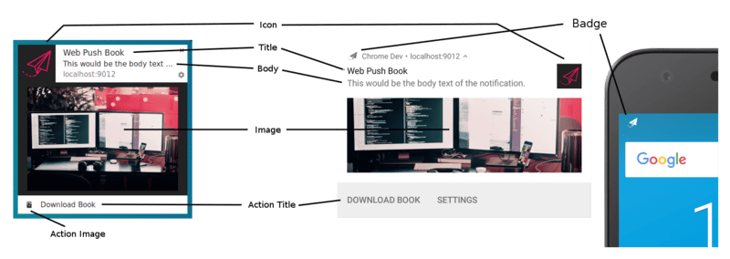
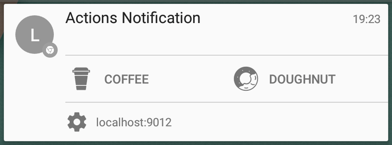

>原文地址：https://developers.google.com/web/fundamentals/push-notifications/display-a-notification

>译文地址：

>译者：刘文涛

>校对者：

# 显示一个通知

我将通知参数分为两部分，一部分处理视觉（本节），另一部分解释通知的行为。

这么做的原因是每个开发人员都需要担心视觉方面，而行为方面则取决于你使用推送的方式。

下面所有的例子的源代码，都来自我的一个demo页面。 如果你想自己测试它们，请点击下面的按钮。

[Notification Demos](https://web-push-book.gauntface.com/demos/notification-examples/)

## 视觉显示相关参数

显示一个通知的API很简单，如下：

    <ServiceWorkerRegistration>.showNotification(<title>, <options>);

title是一个字符串类型，options 的参数如下：

    {
      "//": "Visual Options",
      "body": "<String>",
      "icon": "<URL String>",
      "image": "<URL String>",
      "badge": "<URL String>",
      "vibrate": "<Array of Integers>",
      "sound": "<URL String>",
      "dir": "<String of 'auto' | 'ltr' | 'rtl'>",

      "//": "Behavioural Options",
      "tag": "<String>",
      "data": "<Anything>",
      "requireInteraction": "<boolean>",
      "renotify": "<Boolean>",
      "silent": "<Boolean>",

      "//": "Both Visual & Behavioural Options",
      "actions": "<Array of Strings>",

      "//": "Information Option. No visual affect.",
      "timestamp": "<Long>"
    }

首先让我们看看视觉相关的参数，如下图：

### title 和 body 参数

title 和 body 参数，顾名思义，即通知上显示的两块不同区域的文本（标题和文本）

如果我们运行以下代码：

        const title = 'Simple Title';
        const options = {
          body: 'Simple piece of body text.\nSecond line of body text :)'
        };
        registration.showNotification(title, options);

我们会在 chrome 中收到如下通知：

在 Linux 的 Firefox 上，它看起来是这样的：

我很好奇，如果我添加了大量文本会发生什么，其结果是：

有趣的是，Linux 上的 Firefox 截断了正文的部分，直到鼠标 hover 到通知上面时，会展开显示全部

我文中加入这些例子的原因有2个。首先浏览器之间会有显示上的差异。单单只看文本，Firefox 和 Chrome 在显示和行为上有所不同。 其次是跨平台存在差异。 Chrome 为所有平台提供自定义用户界面，而 Linux 机器上的 Firefox 则使用系统通知。 相同的通知在 windows 上的 Firefox 显示如下：

### Icon

参数 `icon` 其实就是在标题和正文旁边展示的一张小图。

在你的代码中，你只需要提供一个你想加载的图片 URL。

        const title = 'Icon Notification';
        const options = {
          icon: '/images/demos/icon-512x512.png'
        };
        registration.showNotification(title, options);

Linux 的 Chrome 上，我们收到的通知如下：

Firefox：

悲伤的是，图标大小并没有固定标准。
[Android似乎想要一个64dp的图像](http://stackoverflow.com/questions/7220738/honeycomb-notifications-how-to-set-largeicon-to-the-right-size)（这是设备像素比例的64倍）。

如果我们假设设备的最高像素比例为3，那么192像素及以上大小的图片是安全的。

注意：某些浏览器可能需要HTTPS协议头的图像。 如果你打算使用第三方图像，请注意这一点。

### Badge

`badge` 是一个小的单色图标，用于向用户展示更多信息，告知用户消息是从哪里来的。

        const title = 'Badge Notification';
        const options = {
          badge: '/images/demos/badge-128x128.png'
        };
        registration.showNotification(title, options);

在写本文时，badge 仅适用于 Android 版 Chrome。

在其他浏览器（或没有指定 badge 的 Chrome）上，你会看到浏览器的图标。

与 icon 参数一样，这里没有关于使用什么尺寸的 实际标准。

通过参考 [Android
guidelines](https://developer.android.com/guide/practices/ui_guidelines/icon_design_status_bar.html)，建议的大小是24px乘以设备像素比例。

也就是说使用大于72px大小的图片应该是合适的（假设设备的最大像素比率为3）。

### Image

`image` 参数可用于向用户展示较大的图片。尤其适合展示预览图。

        const title = 'Image Notification';
        const options = {
          image: '/images/demos/unsplash-farzad-nazifi-1600x1100.jpg'
        };
        registration.showNotification(title, options);

在系统桌面上，通知显示样式如下：

在Android上，图片展示的 裁剪方式和显示的比例是不同的，如下图：

鉴于桌面和移动设备之间的图片显示比例差异，给一个标准是极其困难的。

如上图所示，桌面版 Chrome 中，并未完全填充，空间比例为4：3，也许最好的方法是以此比例设置图片，并允许 Android 裁剪图片。 话虽然是这样说，image 参数 仍是一个新的属性，显示的形式是可能会改变的。

在 Android 上，我能找到的唯一的[标准宽度](https://code.google.com/p/android/issues/detail?id=36744)是450dp。

基于这个标准，宽度为1350px或更高的图像将是一个不错的选择（假设设备的最大像素比率为3）。

### Actions

你可以定义 `actions` ，来显示带按钮的通知。

        const title = 'Actions Notification';
        const options = {
          actions: [
            {
              action: 'coffee-action',
              title: 'Coffee',
              icon: '/images/demos/action-1-128x128.png'
            },
            {
              action: 'doughnut-action',
              title: 'Doughnut',
              icon: '/images/demos/action-2-128x128.png'
            },
            {
              action: 'gramophone-action',
              title: 'gramophone',
              icon: '/images/demos/action-3-128x128.png'
            },
            {
              action: 'atom-action',
              title: 'Atom',
              icon: '/images/demos/action-4-128x128.png'
            }
          ]
        };

        const maxVisibleActions = Notification.maxActions;
        if (maxVisibleActions < 4) {
          options.body = `This notification will only display ` +
            `${maxVisibleActions} actions.`;
        } else {
          options.body = `This notification can display up to ` +
            `${maxVisibleActions} actions.`;
        }

        registration.showNotification(title, options);

目前只有 Chrome 和 Android 中的 Opera 支持 actions 参数。

对于每个 action，你可以定义一个 title，一个“action”（即一个 ID）和一个图标。标题和图标是你可以在通知中看到的内容。ID 是用来检测操作按钮是否已经被点击过（我们将在下一节中更详细地介绍这一点）。

在上面的示例中，我定义了 4 个 actions，来证明你可以定义比显示的 actions 更多的 actions。 如果你想知道浏览器可以显示多少个action 按钮，你可以查看演示正文中使用的 `Notification.maxActions`。

在桌面端上，操作按钮图标会显示本身的颜色（请参阅上面的粉色甜甜圈 icon）。

在 Android 6.0 Marshmallow 上，图标被改变颜色以匹配系统配色方案：

Chrome 将有望改变在桌面端的行为 ，与 Android 相匹配（即应用适当的配色方案使图标与系统配色相匹配）。同时，你可以手动修改图标颜色为"#333333"，来匹配 Chrome 的文字颜色。

在 Android 7.0 Nougat 上，action 图标是根本不显示的。

值得一提的是，这些图标在 Android 上看起来很清晰，但在桌面上看起来**不**那么清晰。

在桌面版 Chrome 上使用的最佳尺寸是24px x 24px。 可惜这个在 Android 上看起来不合适。

所以，我们可以从这些差异中得出最佳实践：

- 给图标选择一致的配色方案，让图标可以在各端显示保持一致。
- 请使用单色图标，因为有些平台可能会以这种方式显示它们。
- 去测试图标大小，看看对你来说适合的尺寸是什么。128px * 128px对我来说在 Android 上是合适的，但在桌面上显示，图像质量比较差。
- 要有 action 图标不显示的心理预期。

Notification 规范正在探索一种可以定义多种尺寸图标的方式，但似乎到最终达成共识之前还是需要一些时间。

### Direction

“dir”参数允许你定义文本显示的方向：从右到左或从左到右。

在测试中，显示的方向似乎很大程度上取决于文本，而不是这个参数。根据规范，这个参数用于建议浏览器如何显示文本（如同 actions 中的参数），但是并没有什么用。

如果需要定义文字方向的话，最好定义一下，否则浏览器可能会根据提供的文本按照默认的方式显示。

该参数应可以设置为：`auto`，`ltr`或`rtl`。

RTL（从右向左）语言在 Linux 的 Chrome 上显示如下：

在 Firefox 上（当鼠标悬停在上面时），你会得到的显示如下：

### Vibrate

假设用户设备当前设置允许振动（即设备不处于静音模式），vibrate 参数可以让你显示一条通知的时候，使用振动模式。

vibrate 参数的格式是一组数字，用于描述设备应该振动的毫秒数，后面跟着设备**不应该**振动的毫秒数。

        const title = 'Vibrate Notification';
        const options = {
          // Star Wars shamelessly taken from the awesome Peter Beverloo
          // https://tests.peter.sh/notification-generator/
          vibrate: [500,110,500,110,450,110,200,110,170,40,450,110,200,110,170,40,500]
        };
        registration.showNotification(title, options);

该参数只对支持振动的设备有作用。

### Sound

sound 参数允许你定义一个音频，在收到通知时可以播放。

在写本文时，没有浏览器支持这个参数。

        const title = 'Sound Notification';
        const options = {
          sound: '/demos/notification-examples/audio/notification-sound.mp3'
        };
        registration.showNotification(title, options);

### Timestamp

Timestamp 参数用于告诉平台触发推送消息事件的时间。 

`timestamp` 参数 是从00:00:00，即1970年1月1日（即 unix 时间）开始的毫秒数。

        const title = 'Timestamp Notification';
        const options = {
          body: 'Timestamp is set to "01 Jan 2000 00:00:00".',
          timestamp: Date.parse('01 Jan 2000 00:00:00')
        };
        registration.showNotification(title, options);

## 用户体验最佳实践

在通知中，信息的显示缺乏独特性是我所见最失败的用户体验。

首先你应该考虑为什么要推送这个通知，并且确保所有的通知参数都能帮助用户理解为什么他们需要阅读这个通知。

看例子很容易，你会觉得“我永远不会犯这个错”，但是掉入这个陷阱比你想象的要更容易。

下面是一些我们需要避免的常见陷阱

* 不要把你的网站地址放在标题或正文中。 浏览器在通知的时候会包含你的域名，所以**不要重复显示**。
* 使用你可用的所有信息。 如果你发送推送消息是要表达有人向用户发送了消息，不应该使用标题为“新消息”，正文内容为“点击此处阅读该消息”的方式。而是应该使用标题为“约翰刚刚发送了一条新消息”，正文为部分消息的方式去呈现。

## 浏览器支持度

在写本文时，Chrome 和 Firefox 在通知功能支持方面存在很大差异。

幸运的是，你可以通过查看 Notification 原型来检测浏览器对通知功能的支持。

如果我们想知道通知是否支持操作按钮，我们会执行以下操作：

    if ('actions' in Notification.prototype) {
      // Action buttons are supported.
    } else {
      // Action buttons are NOT supported.
    }

有了这个，我们可以更改我们向用户展示的通知。

使用其他参数，只需执行与上面相同的方法，将 “actions” 替换为所需的参数名称。
