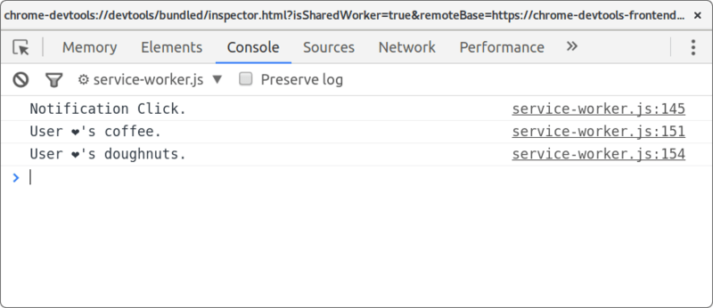
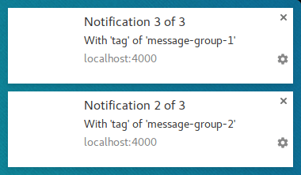

>原文地址：https://developers.google.com/web/fundamentals/push-notifications/notification-behaviour

>译文地址：

>译者：任家乐

>校对者：

# Notification Behaviour
通知行为

So far we've looked at the options that alter the visual appearance of a notification. There
are also options that alter the behaviour of notifications.
到此位置我们已经浏览了可以改变通知样式的选项。这里还有一些选项可以改变通知的行为。

Be default, calling `showNotification()` with just visual options will have
the following behaviours:
默认情况下，在设置好视觉相关选项时，调用"showNotification()" 方法会有以下行为：

- Clicking on the notification does nothing.
- 点击通知不会触发任何事件。
- Each new notification is shown one after the other. The browser will not collapse the
notifications in any way.
- 每个新的通知会一个接着一个有序的展示。浏览器不会以任何方式叠加展示通知。
- The platform may play a sound or vibrate the user's devices (depending on the platform).
- 系统会声音提醒或震动用户的设备（何种方式取决于设备的系统）。
- On some platforms the notification will disappear after a short
period of time while others will show the notification unless the user interacts with it.
(For example, compare your notifications on Android and Desktop.)
- 一些系统上，短暂时间后通知会自动消失而其他的系统则会一直展示通知直到用户与它进行交互。（例如，你可以比较安卓和电脑的通知）

In this section we are going to look at how we can alter these default behaviours using options
alone. These are relatively easy to implement and take advantage of.
在这一节中，我们会探讨怎样用给出的选项来改变这些默认的通知行为，这些都相对来说比较简单实施和有优势。

### Notification Click Event
### 通知的点击事件

When a user clicks on a notification the default behaviour is for nothing
to happen. It doesn't even close or remove the notification.
当用户点击通知时，默认不会触发任何事件。它不会关闭或移除通知。

The common practice for a notification click is for it to close and perform some other logic
(i.e. open a window or make some API call to the application).
通知最普通的实践就是如何让其关闭并展示一些其他的交互逻辑（例如，打开一个窗口或调用一些API）

To achieve this we need to add a 'notificationclick' event listener to our service worker. This
will be called when ever a notification is clicked.
要实现以上所说的，我们需要给service worker添加一个'notificationclick'事件。这个事件会在点击通知时被调用。

    self.addEventListener('notificationclick', function(event) {
      const clickedNotification = event.notification;
      clickedNotification.close();

      // Do something as the result of the notification click
      const promiseChain = doSomething();
      event.waitUntil(promiseChain);
    });

As you can see in this example, the notification that was clicked can be
accessed via the `event.notification` parameter. From this we can access
the notifications properties and methods. In this case we call its
`close()` method and perform additional work.

从上面给出的demo代码可以看到，被点击的通知可以通过event.notification参数来访问。通过这个参数我们可以访问通知的属性和方法，那么我们可以调用'close()'方法
并且执行一些额外的工作。
Note: You still need to make use of event.waitUntil() to keep the service worker running
while your code is busy.
提示：你仍然需要利用event.waitUntil()事件保持service worker在你的程序运作高峰期还能持续工作。

### Actions
### 行为

Actions allow you to give users another level of interaction with your users
over just clicking the notification.
行为可以让你给用户另外一个等级的交互体验，相比于只是点击行为的交互。

In the previous section you saw how to define actions when calling
`showNotification()`:
在上一节中，我们看到了如何调用showNotification()来定义行为：

        const title = 'Actions Notification';
        const options = {
          actions: [
            {
              action: 'coffee-action',
              title: 'Coffee',
              icon: '/images/demos/action-1-128x128.png'
            },
            {
              action: 'doughnut-action',
              title: 'Doughnut',
              icon: '/images/demos/action-2-128x128.png'
            },
            {
              action: 'gramophone-action',
              title: 'gramophone',
              icon: '/images/demos/action-3-128x128.png'
            },
            {
              action: 'atom-action',
              title: 'Atom',
              icon: '/images/demos/action-4-128x128.png'
            }
          ]
        };

        const maxVisibleActions = Notification.maxActions;
        if (maxVisibleActions < 4) {
          options.body = `This notification will only display ` +
            `${maxVisibleActions} actions.`;
        } else {
          options.body = `This notification can display up to ` +
            `${maxVisibleActions} actions.`;
        }

        registration.showNotification(title, options);

If the user clicks an action button, check the `event.action` value in
the `noticationclick` event to tell which action button was clicked.
如果用户点击了行为按钮，可以在'notificationclick'方法的回调中检查'event.action'的值，它可以告诉你被点击的action按钮时哪个。

`event.action` will contain the `action` value set in the options. In the example above the
`event.action` values would be one of the following: 'coffee-action', 'doughnut-action',
'gramophone-action' or 'atom-action'.
'event.action'

'event.action'会包含options选项中'action'值的集合。在上面的例子中'event.action'的值会是'coffee-action', 'doughnut-action',
'gramophone-action' or 'atom-action'的其中一个。
With this we would detect notification clicks or action clicks like so:
通过event.action，我们可以通过下面代码所示来探测通知的点击或action的点击。

    self.addEventListener('notificationclick', function(event) {
      if (!event.action) {
        // Was a normal notification click
        console.log('Notification Click.');
        return;
      }

      switch (event.action) {
        case 'coffee-action':
          console.log('User ❤️️\'s coffee.');
          break;
        case 'doughnut-action':
          console.log('User ❤️️\'s doughnuts.');
          break;
        case 'gramophone-action':
          console.log('User ❤️️\'s music.');
          break;
        case 'atom-action':
          console.log('User ❤️️\'s science.');
          break;
        default:
          console.log(`Unknown action clicked: '${event.action}'`);
          break;
      }
    });

### Tag
### 标签

The *tag* option is essentially a string ID that "groups" notifications together, providing
an easy way to determine how multiple notifications are displayed to the user. This is easiest
to explain with an example.
标签的选项基本上是一个字符串类型的ID来把所有通知聚集到一起，提供了一个简单的方式来决定怎样展示给用户多个通知。可能用示例来解释更为简单：

Let's display a notification and give it a tag, of
'message-group-1'. We'd display the notification with this code:
让我们展示一个通知，并给它一个标签，比如'message-group-1'. 我们可以用以下代码来展示通知：

        const title = 'Notification 1 of 3';
        const options = {
          body: 'With \'tag\' of \'message-group-1\'',
          tag: 'message-group-1'
        };
        registration.showNotification(title, options);

Which will show our first notification.
以上代码会展示我们的第一个通知。

Let's display a second notification with a new tag of 'message-group-2', like so:
让我们用一个新的标签'message-group-2'来展示第二个通知，就像这样：

            const title = 'Notification 2 of 3';
            const options = {
              body: 'With \'tag\' of \'message-group-2\'',
              tag: 'message-group-2'
            };
            registration.showNotification(title, options);

 This will display a second notification to the user.
 以上代码会给用户展示第二个通知。

Now let's show a third notification but re-use the first tag of 'message-group-1'. Doing this
will close the first notification and replace it with our new notification.
现在让我们展示第三个通知，但不新增标签，而是重用我们第一次定义的标签'message-group-1'.

            const title = 'Notification 3 of 3';
            const options = {
              body: 'With \'tag\' of \'message-group-1\'',
              tag: 'message-group-1'
            };
            registration.showNotification(title, options);

Now we have two notifications even though `showNotification()` was called three times.
现在即使我们调用'showNotification()'3次我们也只会展示2个通知。

The `tag` option is simply a way of grouping messages so that any old notifications that
are currently displayed will be closed if they have the same tag as a new notification.
标签的选项可以看作一个简单的用于分类信息的方式，因此任何当前被展示的旧的通知将会被关闭，如果他们像新的通知一样有相同的标签。

A subtlety to using `tag` is that when it replaces a notification, it
will do so *without* a sound and vibration.
标签还有一个巧妙的使用方式：当它代替了通知，它会没有声音和震动的进行通知。

This is where the `renotify` option comes in.
这就是'重复通知'选项出现的原因。

### Renotify
### 重复通知

This largely applies to mobile devices at the time of writing. Setting this option makes new
notifications vibrate and play a system sound.
这个选项大部分情况被应用于写作时间，设置它可以震动并播放系统声音来进行新的通知。

There are scenarios where you might want a replacing notification to
notify the user rather than silently update. Chat applications are a good
example. In this case you should set `tag` and `renotify` to true.
有一些场景你可能会更想要一种替代传统的通知方式，而不是默默地进行更新。聊天应用会是一个很好的示例，这种情况你需要开启'标签'和'重复通知'选项。

            const title = 'Notification 2 of 2';
            const options = {
              tag: 'renotify',
              renotify: true
            };
            registration.showNotification(title, options);

**Note:** If you set `renotify: true` on a notification without a tag, you'll get the following
error:

    TypeError: Failed to execute 'showNotification' on 'ServiceWorkerRegistration':
    Notifications which set the renotify flag must specify a non-empty tag

**注意：** 如果你设置了'renotify'(重复通知)为true但却没有设置标签，会出现以下错误：
    类型错误：不能够在'ServiceWorkerRegistration'上执行'showNotification'方法：设置了'renotify'(重复提醒)标识的通知必须声明一个不为空的标签。

### Silent
### 静音

This option allows you to show a new notification but prevents the default
behavior of vibration, sound and turning on the device's display.
这个选项能让你避免用默认的震动，声音来展示新的提示，同时会打开设备的屏幕。

This is ideal if your notifications don't require immediate attention
from the user.
最理想的情况就是你的通知不需要立马让用户注意到。

        const title = 'Silent Notification';
        const options = {
          silent: true
        };
        registration.showNotification(title, options);

**Note:** If you define both *silent* and *renotify*, silent will take precedence.
**注意** 如果同时设置了*silen(静音)*和*renotify(重复通知)*，silent(静音)选项会取得更高的优先级。

### Requires Interaction
### 交互的需要

Chrome on desktop will show notifications for a set time period before hiding them. Chrome on
Android doesn't have this behaviour. Notifications are displayed until
the user interacts with them.
桌面的chrome浏览器会展示通知一段时间然后关闭。而安卓设备的chrome浏览器不会有这种行为，通知会一直展示，直到用户对其进行操作。

To force a notification to stay visible until the user interacts with it
add the `requireInteraction` option. This will show the notification
until the user dismisses or clicks your notification.
如果要强制让通知持续展示，一直到用户对其进行操作，需要添加'requireInteraction'选项。这个选项的设置会展示通知直到用户驳回或点击它。

        const title = 'Require Interaction Notification';
        const options = {
          body: 'With "requireInteraction: \'true\'".',
          requireInteraction: true
        };
        registration.showNotification(title, options);

Please use this option with consideration. Showing a notification and forcing the user to stop
what they are doing to dismiss your notification can be frustrating.
请谨慎使用这个选项，因为一直展示通知，并且强制让用户停下手头的事情来驳回通知会非常令人讨厌。

In the next section we are going to look at some of the common patterns used on the web for
managing notifications and performing actions such as opening pages when a notification is clicked.
在下一节中，我们会探讨一些可以在web上适用的通用模式来管理通知，同时在点击通知时执行打开网页的行为。

