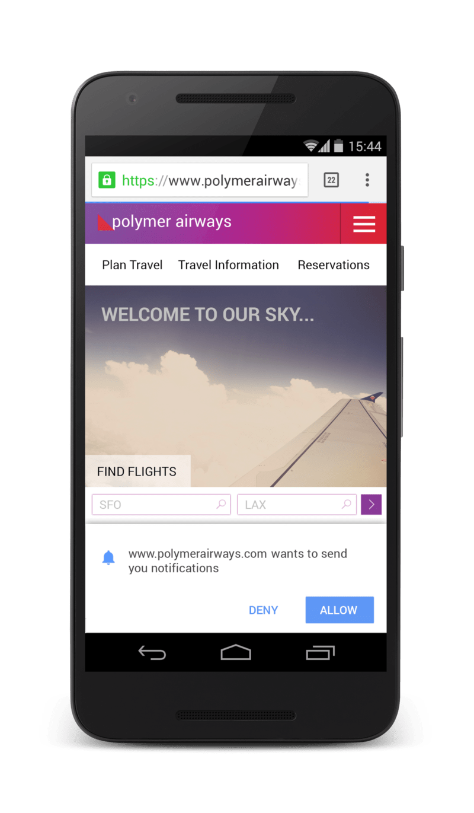
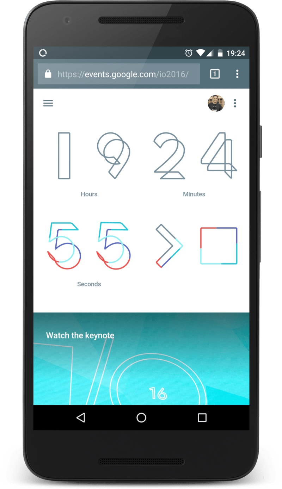

>原文地址：https://developers.google.com/web/fundamentals/push-notifications/permission-ux

>译文地址：

>译者：

>校对者：

# Permission UX

The natural step after getting a `PushSubscription` and saving it our server is
to trigger a push message, but there is one thing I flagrantly glossed over. The
user experience when asking for permission from the user to send them push
messages.

Sadly, very few sites give much consideration to how they ask their user for
permission, so let's take a brief aside to look at both good and bad UX.

## Common Patterns

There have been a few common patterns emerging that should guide and help you when
deciding what is best for your users and use case.

### Value Proposition

Ask users to subscribe to push at a time when the benefit is obvious.

For example, a user has just bought an item on an online store and finished the
checkout flow. The site can then offer updates on the delivery status.

There are a range of situations where this approach works:
- A particular item is out of stock, would you like to be notified when it's next available?
- This breaking news story will be regularly updated, would you like to be notified as the
story develops?
- You're the highest bidder, would you like to be notified if you are outbid?

These are all points where the user has invested in your service and there
is a clear value proposition for them to enable push notifications.

[Owen Campbell-Moore](https://twitter.com/owencm) created a mock of a hypothetical airline
website to demonstrate this approach.

After the user has booked a flight it asks if the user would like notifications of flight
delays.

{: .device-image .center-image }

Note that this is a custom UI from the website.

Another nice touch to Owen's demo is that if the user clicks to enable
notifications, the site adds a semi-transparent overlay on the entire page when
it shows the permission prompt. This draws the users attention to the
permission prompt.

{: .device-image .center-image }

The alternative to this example, the **bad UX** for asking permission, is to request
permission as soon as a user lands on the airline's site.

{: .device-image .center-image }

This approach provides no context as to why notifications are needed or
useful to the user. The user is also blocked from achieving their original
task (i.e. book a flight) by this permission prompt.

### Double Permission

You may feel that your site has a clear use case for push messaging and as
a result want to ask the user for permission as soon as possible.

For example instant messaging and email clients. Showing a message for a
new message or email is an established user experience across a range of
platforms.

For these category of apps, it's worth considering the double permission
pattern.

First show a fake permission prompt that your website controls, consisting
of buttons to allow or ignore the permission request. If the user clicks
allows, request permission, triggering the real browser permission prompt.

With this approach you display a custom permission prompt in your web app
which asks the user to enable notifications. By doing this the user can
chose enable or disable without your website running the risk of being
permanently blocked. If the user selects enable on the custom UI, display
the actual permission prompt, otherwise hide your custom pop-up and ask
some other time.

A good example of this is [Slack](https://slack.com/). They show a prompt at
the top of their page once you've signed in asking if you'd like to enable notifications.

### Settings Panel

You can move notifications into a settings panel, giving users an easy way
to enable and disable push messaging, without the need of cluttering your
web app's UI.

A good example of this is [Google I/O's 2016 site](https://events.google.com/io2016/). When you
first load up the Google I/O site, you aren't asked to do anything,
the user is left to explore the site.

{: .device-image .center-image }

After a few visits, clicking the menu item on the right reveals a settings
panel allowing the user to set up and manage notifications.

{: .device-image .center-image }

Clicking on the checkbox displays the permission prompt. No hidden surprises.

{: .device-image .center-image }

After the permission has been granted the checkbox is checked and the user
is good to go. The great thing about this UI is that users can enable and
disable notifications from one location on the website.

### Passive Approach

One of the easiest ways to offer push to a user is to have a button
or toggle switch that enables / disables push messages in a location
on the page that is consistent throughout a site.

This doesn't drive users to enable push notifications, but offers a
reliable and easy way for users to opt in and out of engaging with your
website. For sites like blogs that might have some regular viewers as well
as high bounce rates, this is a solid option as it targets regular viewers
without annoying drive-by visitors.

On my personal site I have a toggle switch for push messaging in the footer.

It's fairly out of the way, but for regular visitors it should get enough
attention from readers wanting to get updates. One-time visitors are
completely unaffected.

If the user subscribes to push messaging, the state of the toggle switch
changes and maintains state throughout the site.

### The Bad UX

Those are some of the common practices I've noticed on the web. Sadly, there is one very common
bad practice.

The worst thing you can do is instantly show the permission dialog to users as soon as they
land on your site.

They have zero context on why they are being asked for a permission, they may
not even know what your website is for, what it does or what it offers. Blocking
permissions at this point out of frustration is not uncommon, this pop-up is
getting in the way of what they are trying to do.

Remember, if the user *blocks* the permission request, your web app can't ask for permission
again. To get permission after being blocked the user has to change the permission in the
browsers UI and doing so is not easy, obvious or fun for the user.

No matter what, don't ask for permission as soon as the user opens your site, consider some
other UI or approach that has an incentive for the user to grant permission.

### Offer a Way Out

In addition to considering the UX to subscribe a user to push, **please** consider how a user
should unsubscribe or opt out of push messaging.

The number of sites that ask for permission as soon as the page load and then
offers no UI for disabling push notifications is astounding.

Your site should explain to your users how they can disable push. If you don't, users are
likely to take the nuclear option and block permission permanently.
