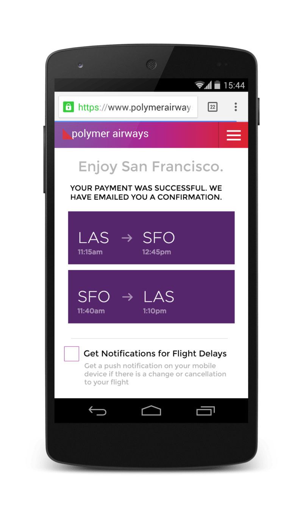
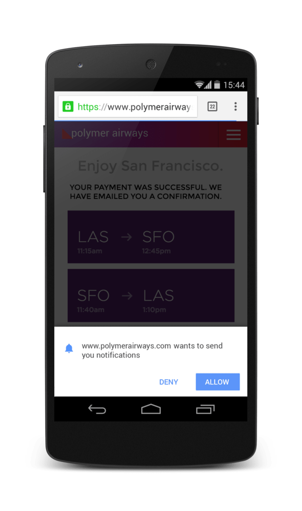
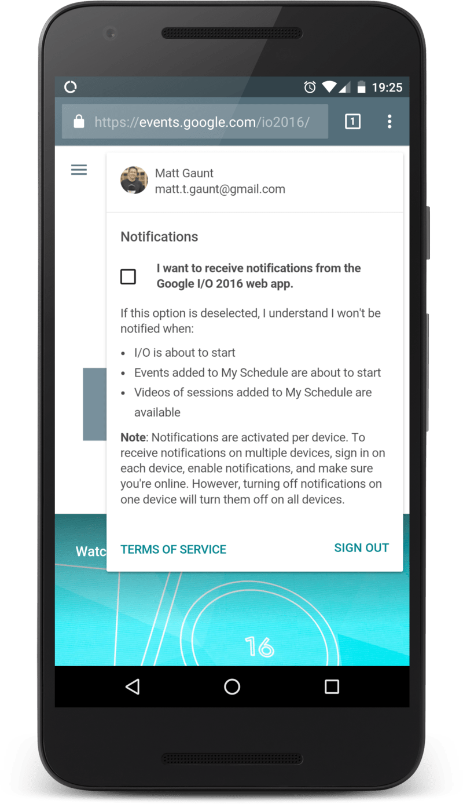
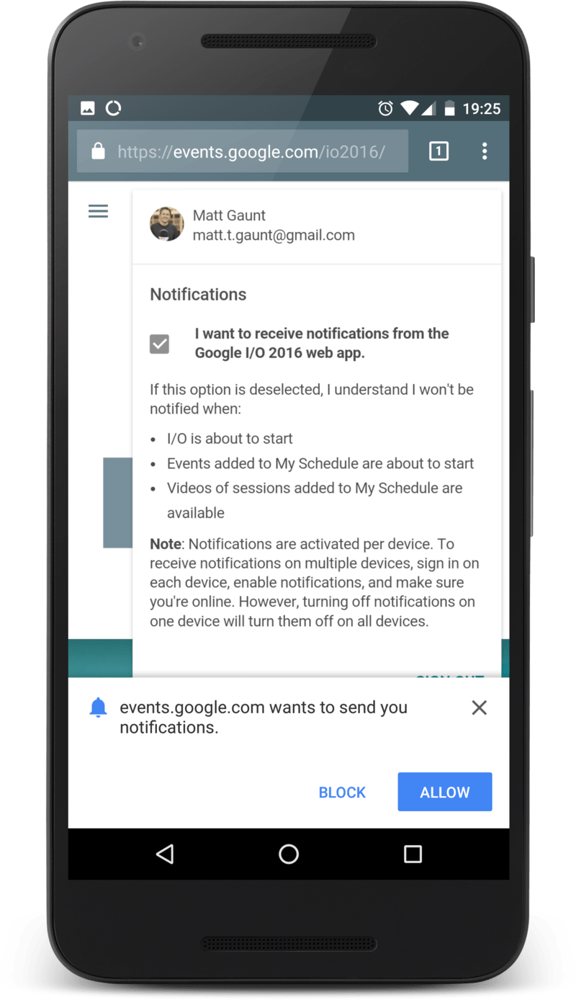
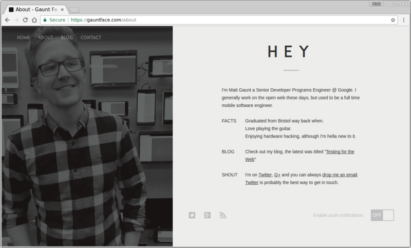

>原文地址：https://developers.google.com/web/fundamentals/push-notifications/permission-ux

>译文地址：

>译者：杨芯芯

>校对者：

# 请求权限的交互

获得 `PushSubscription` 并将其保存到我们的服务器之后，就可以触发推送消息了，但是有一件事我之前一笔带过了，那就是向用户请求权限时的用户体验。

令人遗憾的是，很少有网站会考虑他们应该如何向用户请求权限，所以让我们简单地看看好的和不好的用户体验。

## 常见模式

现有的一些常见模式可以指导并帮助你们决定哪种做法最适合你们的用户和需求。

### 体现价值

在好处显而易见时才请求用户订阅推送。

举个例子，一个用户刚好在网上商店买了东西而且完成了付款流程。这时网站就能提供之后的物流状态更新。

此处还有一系列适用的场景:
- 这种特殊的款已经卖完了，您要不要来个到货通知？
- 这个惊天大新闻会持续更新，您要不要订阅一下？
- 您目前是最高出价人，是否需要通知您当有人出价更高？

这些都是用户投资你的服务的要点，启用推送通知对他们来说有清晰的价值体现。

[Owen Campbell-Moore](https://twitter.com/owencm) 创建了一个虚拟的航空公司网站演示了这种方法。

在用户预订好一个航班之后，它会询问用户是否需要提供通知来提示可能的延误。

{: .device-image .center-image }

请注意，这是网站自定义的用户界面。

这个demo的另一个优点是，假如用户点击启用通知，该网站会在显示权限提示时，在整个页面上添加半透明层，从而让用户注意到权限提示。

{: .device-image .center-image }

与之相对的，即**较差的用户交互**，是在用户打开航空公司网站时立刻就请求权限。

{: .device-image .center-image }

这种方法没有告诉用户为什么他需要通知，或是通知对他是否有用。这种方法也会阻碍用户达成其原有的目标（例如，预订一张机票）。

### 双重权限

你也许觉得你的网站的推送需求十分明确，因此可以立即向用户索要权限。

例如说即时通讯软件或是邮件客户端，在各个平台显示信息或者邮件都是常见的用户体验。

对于这类软件，则更应考虑双重权限模式。

首先显示一个假的权限提示，这个提示由网站自己控制，由两个按钮组成，分别让用户允许或无视权限申请。如果用户点击了允许按钮，就会触发浏览器的权限提示。

通过这个方法——在网站上展示一个自定义的弹窗来请求用户打开通知权限，无论用户现在打开还是不打开通知权限，你的网站都不会有被永久屏蔽的风险。当用户在自定义弹窗中选择了启用通知，你就可以展示真正的权限请求弹窗，反之，你可以隐藏自定义弹窗然后在其他时机展示。、

[Slack](https://slack.com/)就是一个很好的例子。一旦用户登录，他们就会在页面顶部展示一个弹窗，去请求用户启用通知。

### 设置面板

你可以将通知功能放在设置面板中，让用户可以轻松地启用或关闭推送，也能够避免页面ui被打乱。

[Google I/O's 2016 网页](https://events.google.com/io2016/)就是一个很好的例子. 当用户首次加载网站时，他们并不向用户请求任何权限，用户可以自由地探索页面。

{: .device-image .center-image }

几次访问后，单击右侧的菜单项会显示一个设置面板，允许用户设置和管理通知。

{: .device-image .center-image }

单击复选框将显示权限弹窗，没有任何隐藏的惊喜。

{: .device-image .center-image }

用户只要选中复选框，授予权限即可。这个用户界面的有点在于用户可以在页面的固定位置启用或关闭通知。

### 被动方法

向用户推送消息的最简单的方法之一，是在页面的固定位置——同时贯穿全站的位置，放置一个按钮或开关，让用户可以随时启用或关闭通知。

这不会促使用户启用推送通知，但为用户提供了一种可靠且简单的方式来选择与网站互动。对于拥有常规读者以及高跳出率的博客网站而言，这是一个不二选择，因为它针对的是常规读者，并且不会打扰到路过的新用户。

我的个人网站的页脚就有这样一个打开推送的开关。

这种方法相当不错，对常规用户来说，想要获取更新的用户能充分地注意到它。一次性访问者则完全不受影响。

如果用户订阅了推送消息，开关的状态就会在全站更改，并保持打开。

### 不好的交互

这些是我在网上注意到的一些常见做法，然而并不是一些好的尝试。

最差的方法就是在用户进入网站时立即展示权限对话框。

对于收到的权限提示，用户没有任何心理建设。他们可能甚至都不知道你的网站是做什么的，或者提供了什么。在此时他们屏蔽网站通知并不罕见，因为这个弹窗阻碍了他们想做的事情。

记住，如果用户**屏蔽**了你的权限请求，你的网站就再也无法请求通知权限了。要在被屏蔽后获得权限，用户需要在浏览器中修改权限，这对用户来说并不容易、明显或有趣。

无论如何，不要在用户一打开页面时就请求权限。可以考虑其他的用户界面或方法，来激励用户授予权限。

### 提供退路

除了考虑用户订阅推送的交互外，请**务必**考虑用户要取消订阅或推送消息的情况

令人震惊的是，依然有很多网站在用户进入页面时立即请求权限，并且不提供禁用推送的用户界面。

你的网站应该向用户说明如何禁用推送。否则用户可能会采取极端的方案——永久禁用推送权限。
